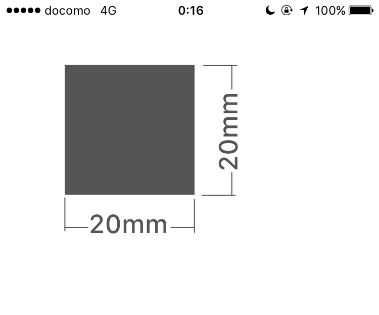

TrueScale make CGRect, CGsize, CGPoint from Real Units.

## Features
- Make CGRect, CGsize, CGPoint from [mm], [cm] and [inch].

## How to Use

### CGRect from [mm]

```
let frame = TSRect(x: 10, y: 10, width: 20, height: 20, unit: .mm).cgrect
let square = UIView(frame: frame)
square.backgroundColor = UIColor.darkGray
```


### Use other units

```
//[cm]
let frame = TSRect(x: 1, y: 1, width: 2, height: 2, unit: .cm).cgrect

//[inch]
let frame = TSRect(x: 1, y: 1, width: 2, height: 2, unit: .inch).cgrect
```

### Point & Size

```
let size = TSSize(width: 30, height: 30, unit: .mm)
let point = TSPoint(x: 1, y: 1, unit: .inch)
```

### extension for CGFloat
```
let pointValue = CGFloat(1).toPoint(unit: .cm)
```

## Requirements
- iOS8.0+
- Swift3.0+
- Xcode8.1+

iOS Simulator, watchOS, tvOS and macOS is not supported.


## Installation

### Carthage
```
github "ReoHokazono/TrueScale"
```

### CocoaPods
```
pod 'TrueScale'
```

### Manually
Add `TrueScale.Swift` for your project.

## License
TrueScale is released under the MIT license. See LICENSE for details.